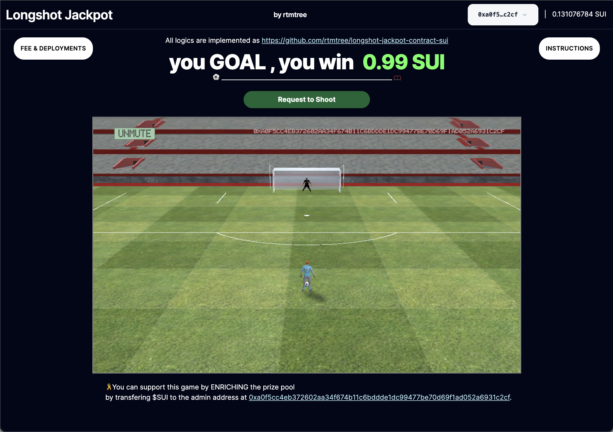

# Longshot Jackpot Smart Contract
This is a smart contract for Longshot Jackpot, a Blockchain football game. The code is written in Move programming language and designed for using in Sui chain.

  

## Deployed DApp

[Testnet](https://longshot-jackpot.vercel.app/?network=suitestnet)

## Deployed Smart Contract

**Testnet**

- Package: 
[0x1c394f56455fe46153a3fe333f735193b0f3480ba0a6fe6dfcc48cadacea0589](https://suiscan.xyz/testnet/object/0x1c394f56455fe46153a3fe333f735193b0f3480ba0a6fe6dfcc48cadacea0589/contracts)

- Object: 
[0x0c50a7fe35798903986fbda016fab7ddfa79854da5d897ee756f14dca3eee481](https://suiscan.xyz/testnet/object/0x0c50a7fe35798903986fbda016fab7ddfa79854da5d897ee756f14dca3eee481)

## 🎗Contributing
You can support this game to ENRICH the prize pool by donating $SUI to the admin address at 

**Testnet**: 
[0xa0f5cc4eb372602aa34f674b11c6bddde1dc99477be70d69f1ad052a6931c2cf](https://suiscan.xyz/testnet/account/0xa0f5cc4eb372602aa34f674b11c6bddde1dc99477be70d69f1ad052a6931c2cf)

